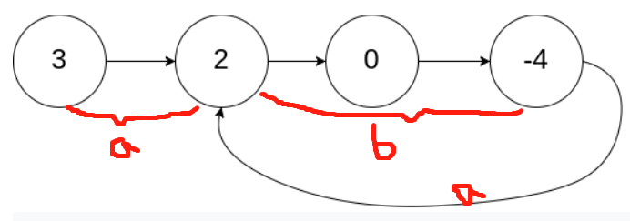

Subject: [Linked List Cycle II](https://leetcode.com/problems/linked-list-cycle-ii/)

Given a linked list, return the node where the cycle begins. If there is no cycle, return null.

There is a cycle in a linked list if there is some node in the list that can be reached again by continuously following the next pointer. Internally, pos is used to denote the index of the node that tail's next pointer is connected to. Note that pos is not passed as a parameter.

Notice that you should not modify the linked list.

eg:

Input: head = [3,2,0,-4], pos = 1

Output: tail connects to node index 1

Explanation: There is a cycle in the linked list, where tail connects to the second node.

Answer: 
用一快一慢两个指针遍历链表，两个指针相遇的节点到环形入口的距离，跟表头到环形入口的距离相等。
第一次相遇时，快指针走的路程是慢指针的两倍

R: 环形长度

(a + b) * 2 = a + b + R => a = R - b

所以只要先获取两个指针相遇的节点。然后分别从头部和meetingNode往下遍历，两个指针指向同一个节点时，就是入口。
