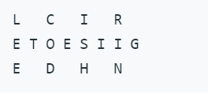
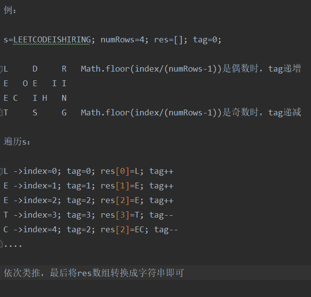

题目：

将一个给定字符串根据给定的行数，以从上往下、从左到右进行 Z 字形排列。

比如输入字符串为 "LEETCODEISHIRING" 行数为 3 时，排列如下：

之后，你的输出需要从左往右逐行读取，产生出一个新的字符串，比如："LCIRETOESIIGEDHN"。

链接：https://leetcode-cn.com/problems/zigzag-conversion/

题解：

思路：定义一个数组res，存放结果中每一行的字符，数组长度为给定的行数numRows；遍历字符串s，

将字符存进res的对应下标中，Math.floor(index/(numRows-1))是偶数时，res下标递增；

Math.floor(index/(numRows-1))是奇数时，res下标递减。最后将res数组转换成字符串即可。

例：

