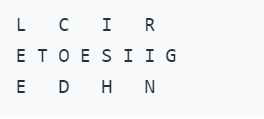
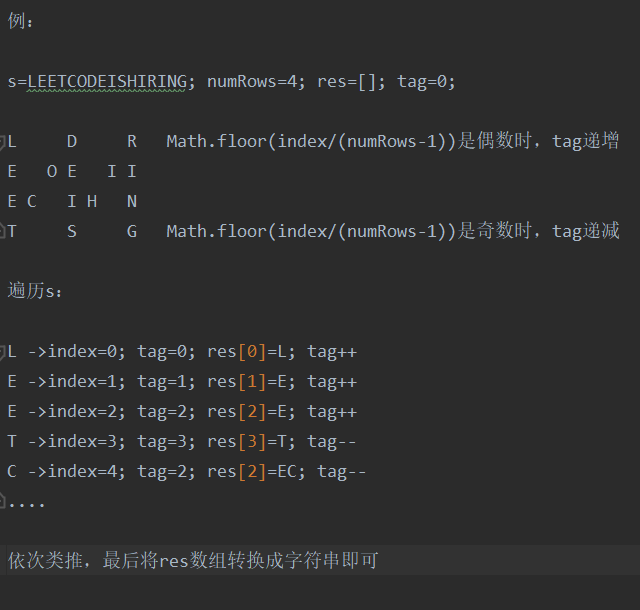

题目：

将一个给定字符串根据给定的行数，以从上往下、从左到右进行 Z 字形排列。

比如输入字符串为 "LEETCODEISHIRING" 行数为 3 时，排列如下：

之后，你的输出需要从左往右逐行读取，产生出一个新的字符串，比如："LCIRETOESIIGEDHN"。

链接：https://leetcode-cn.com/problems/zigzag-conversion/

题解：

思路：定义一个数组res，存放结果中每一行的字符，数组长度为给定的行数numRows；遍历字符串s，

将字符存进res的对应下标中，Math.floor(index/(numRows-1))是偶数时，res下标递增；

Math.floor(index/(numRows-1))是奇数时，res下标递减。最后将res数组转换成字符串即可。

例：

执行用时：96ms，内存消耗：37.7MB

____

Subject: ZigZag Conversion

The string "PAYPALISHIRING" is written in a zigzag pattern on a given number of rows like this: (you may want to display this pattern in a fixed font for better legibility)

~~~~
P   A   H   N
A P L S I I G
Y   I   R
~~~~

And then read line by line: "PAHNAPLSIIGYIR"

Write the code that will take a string and make this conversion given a number of rows:
~~~~
string convert(string s, int numRows);
~~~~

Link: https://leetcode.com/problems/zigzag-conversion/

Answer:

Runtime: 128ms, Memory: 41.5MB
